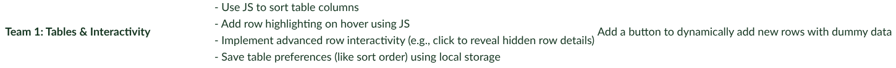
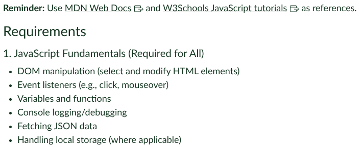

# Mini-Project 
Assignment was to include 3 teams html assignments and have it submitted and on the VM under a Team1 folder.
This is an adeptation from the original project as we we're tasked with experimenting with SCSS and using it to override default variables of Bootstrap.
View through Github page: https://moonlight693.github.io/Team-SCSS/
## By: Evan Whitmer, Claire Cardie, Thor Pilegaard

## The week's assignment
The focus of this week is Javascript. Each team member implements at least one function from this list.

As well as following these requirements

